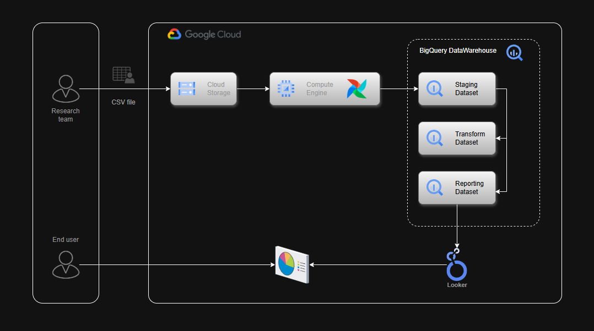
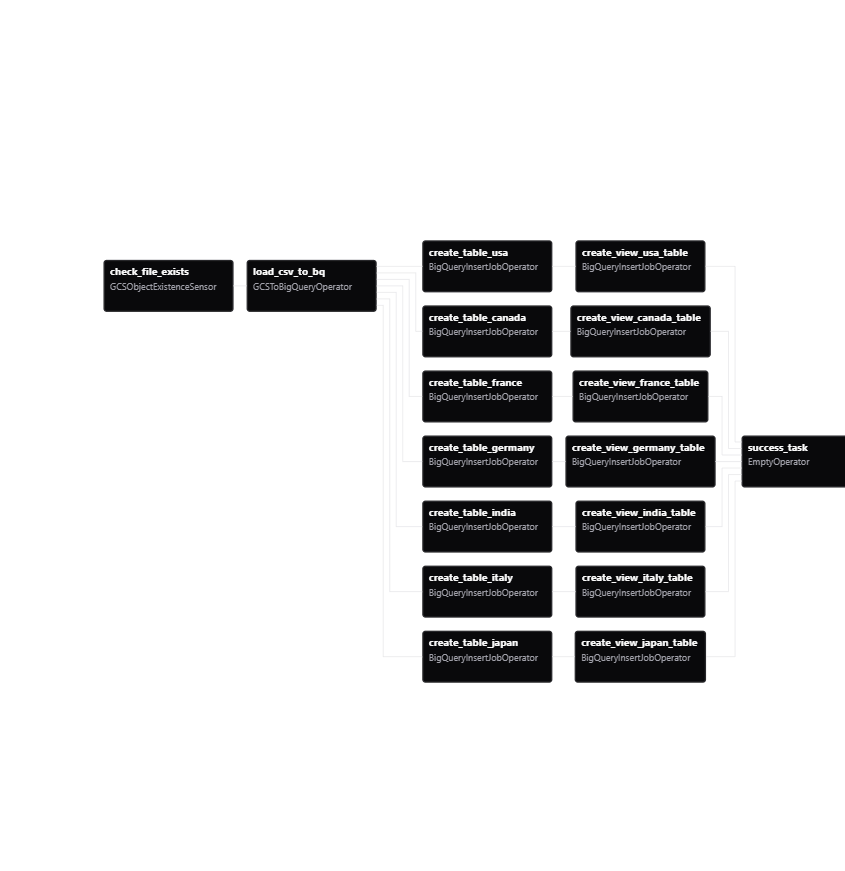

# 🚀 ELT Data Pipeline with GCP and Apache Airflow

This project demonstrates how to build an **ELT (Extract, Load, Transform)** data pipeline to process **1 million+ records** using **Google Cloud Platform (GCP)** and **Apache Airflow**.  

The pipeline extracts global health data from **Google Cloud Storage (GCS)**, loads it into **BigQuery**, and transforms it into **country-specific tables and views**. Each country’s health ministry can securely analyze only their respective data — especially diseases with no available vaccines or treatment.

---

## 📌 Problem Statement

- The global health dataset contains **1M+ records** for multiple countries in a single CSV file.
- Due to confidentiality, each **Health Minister** should access only their country’s data.
- Analysis is needed for **diseases with no treatment or vaccination**.
- Processing such a **large CSV manually is inefficient** and prone to errors.

---

## 🎯 Objectives

✔️ Automate ingestion of the dataset into BigQuery  
✔️ Transform the dataset into **country-specific tables**  
✔️ Create **reporting views** filtered for analysis (no-treatment diseases)  
✔️ Secure access to **only relevant data per country**  
✔️ Build a reporting layer for visualization in **Looker Studio**

---

## ⚙️ Architecture



---

## 🛠️ Workflow

1. **Extract**:  
   - Check if file exists in GCS (`GCSObjectExistenceSensor`).

2. **Load**:  
   - Load raw CSV into BigQuery **staging table** (`GCSToBigQueryOperator`).

3. **Transform**:  
   - Create **country-specific tables** in transform dataset.  
   - Create **views** in reporting dataset, filtered for diseases with no treatment.

4. **Reporting**:  
   - Connect Looker Studio to BigQuery reporting views for country-specific dashboards.

---

## 📂 Data Layers

- **Staging Layer** → Raw data (directly loaded from CSV)  
- **Transform Layer** → Country-specific cleaned tables  
- **Reporting Layer** → Views optimized for restricted access and analysis  

---

## 📜 DAG



---

## 📊 Result

Example Looker Studio Dashboard:


---

## ⚡ Tech Stack

- **Google Cloud Platform (GCP)**
  - Cloud Storage  
  - BigQuery  
  - Compute Engine (for Airflow VM)  

- **Apache Airflow**
  - Google Cloud providers package  

- **Visualization**
  - Looker Studio  

---

## 📦 Setup Instructions

1. Clone the repo:
   ```bash
   git clone https://github.com/<your-username>/elt-pipeline-gcp-airflow.git
   cd elt-pipeline-gcp-airflow
